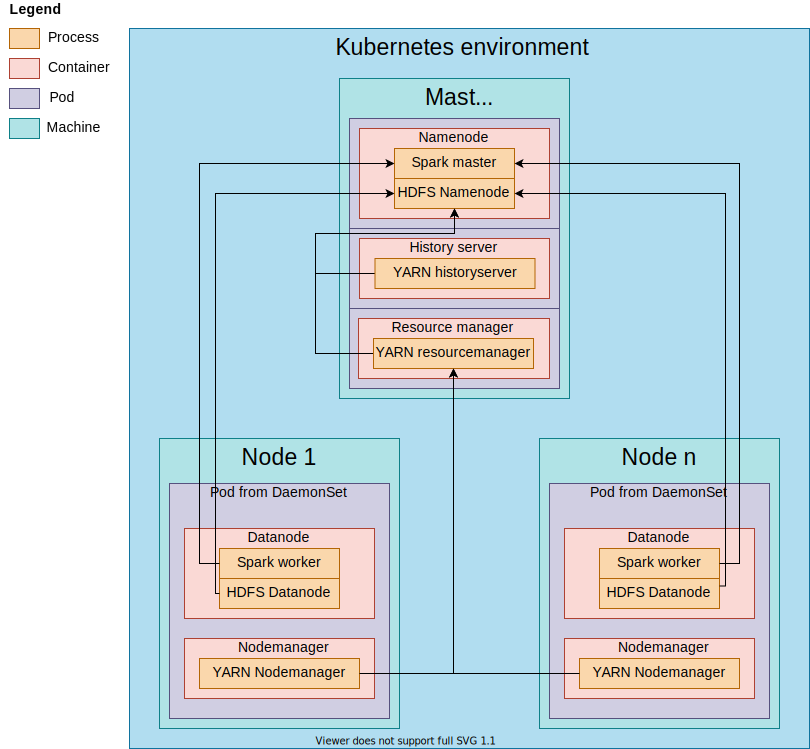

# k8s-bigdata
Apache Spark with HDFS cluster within Kubernetes.

### Overview
As the description says, this repository is a Apache Spark with HDFS cluster within Kubernetes. Although, it contains [Intel HiBench](https://github.com/Intel-bigdata/HiBench) benchmark suit for testing CPU, IO and network usage, but the cluster can be used as a regular one. 

### Supported HiBench Workloads
- Micro
- Machine Learning
- Websearch

### Building k8s-bigdata
You can just simply execute the `build.sh` file.
```sh
$ ./build.sh
```

### Submiting the cluster
To submit the cluster and prepare it, you must type the following `./scripts/init-cluster.sh <WORKLOAD> <BENCHMARK> <INPUT_SIZE>`
Where:
1. `WORKLOAD` represents a workload from [HiBench](https://github.com/Intel-bigdata/HiBench)
2. `BENCHMARK` represents the benchmark 
3. `INPUT_SIZE` means the size of the workload for the benchmark

### Running HiBench
To run a [HiBench](https://github.com/Intel-bigdata/HiBench) benchmark, you can run `./scripts/run.sh <WORKLOAD> <BENCHMARK>`
The report will be saved in the base directory with the name `hibench.report`.

### Features
- k8s-bigdata currently uses Apache Spark 2.4 with Hadoop 2.7 binary
- No need to register manually each `datanode`
- Kubernetes will create a `datanode` for each node registered in the cluster
- Can specify which node `namenode`, `resourcemanager` and `historyserver` will be launched on by assigning the label `type=master`. If you are new to Kubernetes, just type `kubectl label nodes YOURNODE type=master`

### Future works
- Support data streaming frameworks such as Apache Kafka
- Switch static to dynamic environment variables for containers (avoid building on every change in `./hadoop/base/hadoop.env` file)
- Implement a configuration parser to run HiBench without changing `run.sh` 
- Implement a solution to change the size of input data for HiBench benchmarks without accessing `namenode` pod directly

### Architecture


### References
- [Intel HiBench](https://github.com/Intel-bigdata/HiBench#hibench-suite-)
- [Docker Hadoop](https://github.com/big-data-europe/docker-hadoop)
- [Docker Spark](https://github.com/big-data-europe/docker-spark)
- [Apache Spark](https://spark.apache.org/)
- [Apache Hadoop](https://hadoop.apache.org/)
